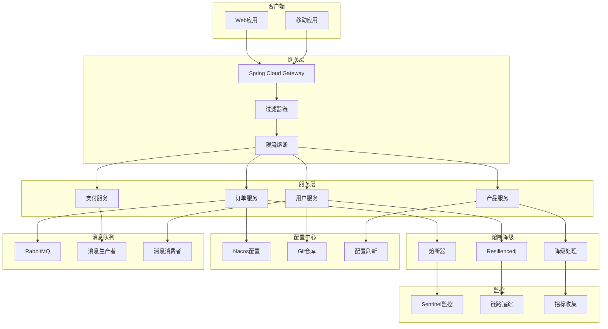

# 🌟 st-springCloud2 - Spring Cloud学习项目(二)


## 📖 项目简介

st-springCloud2是Spring Cloud微服务架构学习的第二阶段项目,重点学习服务熔断降级、服务网关、分布式配置、消息队列等高级特性。

## 🏗️ 系统架构



## 📚 学习模块

### 模块一: 服务熔断降级

- **Resilience4j**: 轻量级容错框架
- **Sentinel**: 阿里巴巴流量控制
- **Hystrix**: Netflix熔断器(已停更)

### 模块二: 服务网关

- **Spring Cloud Gateway**: 响应式网关
- **路由配置**: 动态路由
- **过滤器**: 请求过滤、鉴权

### 模块三: 分布式配置

- **Nacos Config**: 动态配置管理
- **配置热更新**: 实时配置刷新
- **配置加密**: 敏感信息加密

### 模块四: 消息驱动

- **Spring Cloud Stream**: 消息驱动框架
- **RabbitMQ**: 消息队列
- **Kafka**: 分布式消息系统

## 🚀 快速开始

```bash
# 克隆项目
git clone https://github.com/yourusername/st-springCloud2.git

# 编译项目
mvn clean install

# 启动Nacos
# 参考 https://nacos.io/zh-cn/

# 启动Sentinel Dashboard
java -jar sentinel-dashboard.jar

# 启动服务
mvn spring-boot:run
```

## 🛠️ 技术栈

| 技术 | 版本 | 说明 |
|------|------|------|
| Spring Boot | 3.x | 应用框架 |
| Spring Cloud | 2022.x | 微服务框架 |
| Spring Cloud Gateway | 4.x | 服务网关 |
| Resilience4j | 2.x | 容错框架 |
| Sentinel | 1.8+ | 流量控制 |
| Nacos | 2.x | 配置中心 |
| RabbitMQ | 3.x | 消息队列 |

## 💡 核心示例

### 服务熔断(Resilience4j)

```java
@Service
public class OrderService {
    
    @Autowired
    private RestTemplate restTemplate;
    
    @CircuitBreaker(name = "userService", fallbackMethod = "getUserFallback")
    @RateLimiter(name = "userService")
    @Retry(name = "userService")
    public User getUser(Long userId) {
        return restTemplate.getForObject(
            "http://user-service/api/users/" + userId,
            User.class
        );
    }
    
    /**
     * 降级方法
     */
    public User getUserFallback(Long userId, Exception e) {
        // 返回默认用户信息
        User user = new User();
        user.setId(userId);
        user.setName("默认用户");
        return user;
    }
}
```

### Gateway网关配置

```yaml
spring:
  cloud:
    gateway:
      routes:
        - id: user-service
          uri: lb://user-service
          predicates:
            - Path=/api/users/**
          filters:
            - StripPrefix=1
            - name: RequestRateLimiter
              args:
                redis-rate-limiter.replenishRate: 10
                redis-rate-limiter.burstCapacity: 20
                key-resolver: "#{@userKeyResolver}"
        
        - id: order-service
          uri: lb://order-service
          predicates:
            - Path=/api/orders/**
          filters:
            - StripPrefix=1
            - name: Hystrix
              args:
                name: fallbackcmd
                fallbackUri: forward:/fallback
```

### 自定义Gateway过滤器

```java
@Component
public class AuthGlobalFilter implements GlobalFilter, Ordered {
    
    @Override
    public Mono<Void> filter(ServerWebExchange exchange, GatewayFilterChain chain) {
        // 获取请求头中的token
        String token = exchange.getRequest().getHeaders().getFirst("Authorization");
        
        if (StringUtils.isEmpty(token)) {
            // 返回未授权
            exchange.getResponse().setStatusCode(HttpStatus.UNAUTHORIZED);
            return exchange.getResponse().setComplete();
        }
        
        // 验证token
        try {
            Claims claims = JwtUtil.parseToken(token);
            String userId = claims.getSubject();
            
            // 将用户ID添加到请求头
            ServerHttpRequest request = exchange.getRequest().mutate()
                .header("X-User-Id", userId)
                .build();
            
            return chain.filter(exchange.mutate().request(request).build());
        } catch (Exception e) {
            exchange.getResponse().setStatusCode(HttpStatus.UNAUTHORIZED);
            return exchange.getResponse().setComplete();
        }
    }
    
    @Override
    public int getOrder() {
        return 0;
    }
}
```

### Sentinel限流配置

```java
@RestController
@RequestMapping("/api/product")
public class ProductController {
    
    @GetMapping("/{id}")
    @SentinelResource(
        value = "getProduct",
        blockHandler = "handleBlock",
        fallback = "handleFallback"
    )
    public Product getProduct(@PathVariable Long id) {
        return productService.getById(id);
    }
    
    /**
     * 限流处理
     */
    public Product handleBlock(Long id, BlockException ex) {
        Product product = new Product();
        product.setId(id);
        product.setName("系统繁忙,请稍后重试");
        return product;
    }
    
    /**
     * 降级处理
     */
    public Product handleFallback(Long id, Throwable ex) {
        Product product = new Product();
        product.setId(id);
        product.setName("服务暂时不可用");
        return product;
    }
}
```

### 配置中心动态刷新

```java
@RestController
@RefreshScope
@RequestMapping("/api/config")
public class ConfigController {
    
    @Value("${app.name:default}")
    private String appName;
    
    @Value("${app.version:1.0.0}")
    private String version;
    
    @GetMapping
    public Map<String, String> getConfig() {
        Map<String, String> config = new HashMap<>();
        config.put("appName", appName);
        config.put("version", version);
        return config;
    }
}
```

### 消息驱动

```java
// 消息生产者
@Service
public class OrderMessageProducer {
    
    @Autowired
    private StreamBridge streamBridge;
    
    public void sendOrderMessage(Order order) {
        streamBridge.send("order-out-0", order);
    }
}

// 消息消费者
@Service
public class OrderMessageConsumer {
    
    @Bean
    public Consumer<Order> orderConsumer() {
        return order -> {
            System.out.println("收到订单消息: " + order);
            // 处理订单
        };
    }
}
```

## 📊 Sentinel控制台

访问 http://localhost:8080 查看实时监控数据

- 流量控制
- 熔断降级
- 系统负载保护
- 实时监控

## 🎯 核心特性

- **熔断降级**: Resilience4j和Sentinel实现
- **服务网关**: Spring Cloud Gateway
- **限流控制**: 基于QPS的流量控制
- **配置中心**: Nacos动态配置
- **消息驱动**: Spring Cloud Stream
- **链路追踪**: Skywalking集成

## 📝 更新日志

### v1.0.0 (2024-01-01)
- ✨ 初始版本发布
- ✨ 完成服务熔断降级示例
- ✨ 完成Gateway网关配置
- ✨ 完成Nacos配置中心集成
- ✨ 完成消息驱动示例

---

⭐ 如果这个项目对你有帮助,欢迎Star支持!
